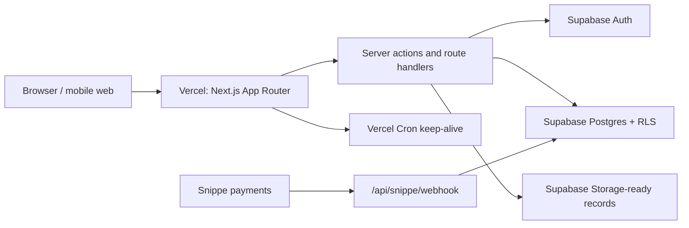

# Architecture

MshaharaPro is a Next.js-first SaaS application backed by Supabase. The active production path is intentionally simple: Vercel runs the web app, server actions, API routes, cron route, PDF/report generation, and webhook handlers; Supabase handles Auth, Postgres, RLS, and storage-backed records.

## Production Shape



## Application Layers

- `src/app`: App Router pages, layouts, server actions, and API routes.
- `src/components`: UI primitives and product components.
- `src/lib/auth`: Supabase session loading, membership-backed roles, and permission checks.
- `src/lib/payroll`: Configurable payroll calculation engine and rule helpers.
- `src/lib/reports`: CSV/PDF report generation helpers.
- `src/lib/billing`: Snippe plan, checkout, and webhook utilities.
- `supabase`: SQL schema, RLS policies, billing patch, employee portal policy patch, and security hardening patch.
- `tests`: Payroll engine, permissions, schema policy, and route/helper tests.

## Backend Decision

The active backend is the Next.js app. Route handlers and server actions now own:

- Supabase-authenticated data reads/writes.
- Payslip PDF generation.
- Report export generation.
- Snippe webhook processing.
- Supabase keep-alive cron.
- Audit logging and RBAC checks.

The older Express/Railway backend is not required for the current MVP and should be treated as archived infrastructure unless a future scaling decision intentionally revives it.

## Data And Tenant Model

Every tenant-owned table is scoped by `organization_id`. Users can belong to multiple organizations through `organization_members`, which is the source of truth for application roles. Server code must never trust user metadata alone for authorization.

Core tables:

- `organizations`
- `organization_members`
- `employees`
- `employee_compensation`
- `payroll_runs`
- `payroll_run_items`
- `payroll_adjustments`
- `statutory_rules`
- `payslips`
- `reports`
- `invites`
- `documents`
- `audit_logs`
- billing subscription tables from `supabase/billing_subscriptions.sql`

## Security Model

- Supabase Auth issues sessions.
- RLS policies restrict direct table visibility.
- Server actions and route handlers re-check permissions before sensitive reads/writes.
- `organization_members` controls roles.
- Employee portal access is restricted to the employee's own profile, documents, and payslip-related records.
- Demo accounts are disabled in production unless both `ENABLE_DEMO_ACCOUNTS` and `NEXT_PUBLIC_ENABLE_DEMO_ACCOUNTS` are explicitly enabled.

## Payroll Engine

Payroll calculations use configurable statutory rules instead of hard-coded compliance assumptions. Rule rows support rates, thresholds, caps, brackets, effective dates, notes, and active status. Recalculation is blocked after a payroll run leaves Draft, and manual adjustments require persisted records plus audit logging.

## External Integrations

- Supabase: Auth, Postgres, RLS, storage-ready data.
- Vercel: hosting, build pipeline, cron, logs, optional Observability.
- Snippe: hosted checkout and payment webhooks.
- Optional Sentry-compatible monitoring through `SENTRY_DSN`.

## Operational Checks

Before production deploy:

```bash
npm run verify
npm run supabase:verify-rls
SMOKE_BASE_URL=https://your-domain.example npm run smoke:prod
```

After database reset or first production setup, apply all Supabase SQL patches including `supabase/security_hardening.sql`.
